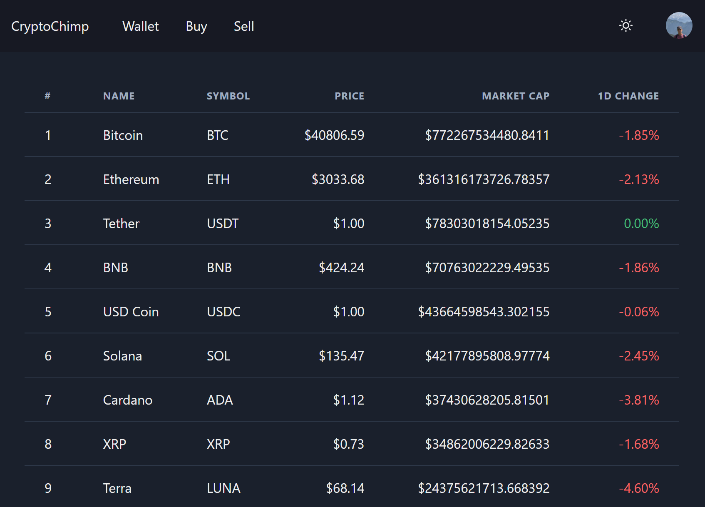

<div align="center">
  
  <h1>CryptoChimp</h1>
  <a href="https://github.com/MaximilianHagelstam/cryptochimp/actions">
    
  </a>
  <a href="https://github.com/MaximilianHagelstam/cryptochimp/commits/main">
    
  </a>
  <a href="https://github.com/MaximilianHagelstam/cryptochimp/blob/main/LICENSE">
    
  </a>
</div>

### 📷 Demo

<a href="https://cryptochimp.vercel.app/">
  
</a>

### ⚙️ Getting started

Install dependencies:

```bash
npm install
```

Create e `.env` file and fill it out as per `.env.example`:

```bash
cp .env.example .env
```

Create database tables from Prisma schema:

```bash
npm run db:push
```

Start the development server:

```bash
npm run dev
```

### 👾 Built with

- [Next.js](https://nextjs.org/)
- [Tailwind CSS](https://tailwindcss.com/)
- [Prisma](https://prisma.io/)
- [PlanetScale](https://planetscale.com/)

### 🎓 License

This project is licensed under the terms of the [MIT](https://choosealicense.com/licenses/mit/) license.
