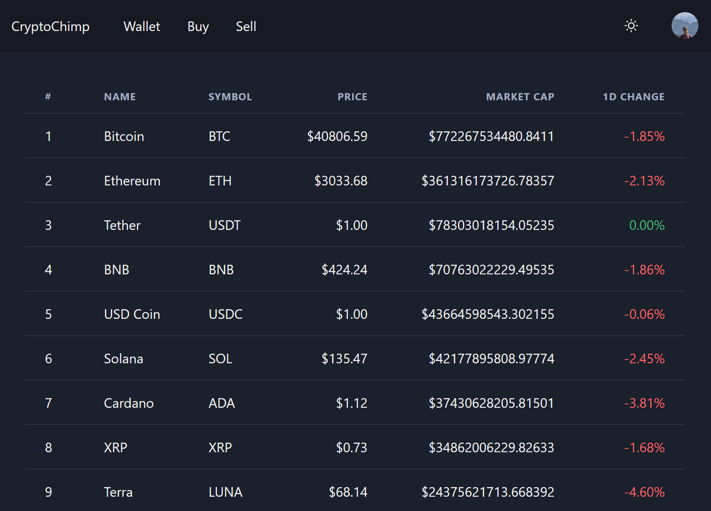

<a href="https://cryptochimp.netlify.app">
  <p align="center">
    
  </p>
</a>

<p align="center">
  <strong>
    Trade cryptocurrency on real market data, but with fake money 🚀
  </strong>
</p>

<h3 align="center">
  <a href="#prerequisites">Prerequisites</a>
  <span> · </span>
  <a href="#getting-started">Getting Started</a>
  <span> · </span>
  <a href="#technologies">Technologies</a>
</h3>

<a href="https://cryptochimp.netlify.app">
  <p align="center">
    
  </p>
</a>

## Prerequisites

- Node.js 12<
- MongoDB
- Yarn
- CoinMarketCap API key
- Google OAuth secrets

## Getting Started

```
# clone repo
git clone https://github.com/MaximilianHagelstam/cryptochimp.git

# move into project
cd cryptochimp

# setup husky
npm install
npm run prepare
```

```
# Server

# move into folder
cd server

# create .env
cp .env.example .env

# install dependencies
yarn install

# run local mongodb instance
mongod

# start server
yarn dev
```

```
# Client

# move into folder
cd client

# create .env
cp .env.example .env

# install dependencies
yarn install

# run app
yarn start
```

## Technologies

- Express.js
- MongoDB
- Mongoose
- Passport.js
- CoinMarketCap API
- Jest
- Supertest
- Husky
- React
- Chakra UI

## License

This project is licensed under the terms of the [MIT](https://choosealicense.com/licenses/mit/) license.
