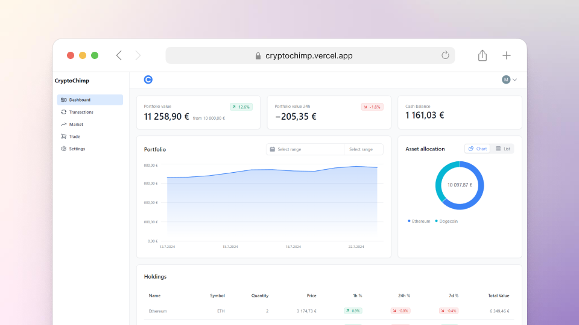

<div align="center">
  
  <h1>CryptoChimp</h1>
  <a href="https://github.com/MaximilianHagelstam/cryptochimp/actions">
    
  </a>
  <a href="https://github.com/MaximilianHagelstam/cryptochimp/commits/main">
    
  </a>
  <a href="https://github.com/MaximilianHagelstam/cryptochimp/network/members">
    
  </a>
  <a href="https://github.com/MaximilianHagelstam/cryptochimp/stargazers">
    
  </a>
  <a href="https://github.com/MaximilianHagelstam/cryptochimp/issues/">
    
  </a>
  <a href="https://github.com/MaximilianHagelstam/cryptochimp/blob/main/LICENSE">
    
  </a>
</div>

### Screenshot

<a href="https://cryptochimp.vercel.app/">
  
</a>

### Run Locally

```bash
git clone https://github.com/MaximilianHagelstam/cryptochimp
cd cryptochimp

# Create a .env file in the root of the project and fill it out as per .env.example

npm install
npm run db:push
npm run dev
```

### Tech Stack

- [Next.js](https://nextjs.org)
- [Tailwind CSS](https://tailwindcss.com)
- [Prisma](https://prisma.io)
- [PlanetScale](https://planetscale.com/)
